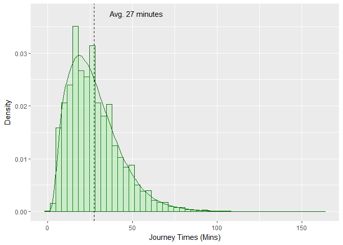

## Data Source

Transport for London (TfL) provides Oyster card data which includes journey information for 5% sample of all oyster card data performed in a week during November 2009 on different public transport modes.

Here, I am going to explore this data set. Will first start by cleaning it and selecting a subset of interest, which is journeys made by London Underground (LUL), National Rail (NR), Docklands Light Railway (DLR), and London Overground (LRc). So, the journeys that I have removed for now are the London Buses and Croydon Tram journeys; this is mainly because detailed information of entry and exit are not available for these journeys, but also because I am more interested in non-road transport modes where journey routes (thus, distances between origin stations and destination stations) are rather fixed.

Here is how the data set looks like as a start:


```r
nrow(oyster_data)
```

```
## [1] 2623487
```

```r
head(oyster_data, n = 5)
```

```
##   downo daytype SubSystem  StartStn          EndStation EntTime
## 1     3     Tue       LUL Unstarted       Kings Cross M       0
## 2     4     Wed       LUL Unstarted        Sudbury Hill       0
## 3     3     Tue        NR Unstarted            Richmond       0
## 4     4     Wed        NR Unstarted             Romford       0
## 5     6     Fri        NR Unstarted Norwood Junction SR       0
##   EntTimeHHMM ExTime EXTimeHHMM ZVPPT JNYTYP DailyCapping FFare DFare
## 1       00:00    633      10:33 Z0104    TKT            N     0     0
## 2       00:00    447      07:27 Z0110    TKT            N     0     0
## 3       00:00    966      16:06 Z0304    TKT            N     0     0
## 4       00:00    657      10:57 Z0110    TKT            N     0     0
## 5       00:00    450      07:30 Z0104    TKT            N     0     0
##   RouteID           FinalProduct
## 1      XX   LUL Travelcard-7 Day
## 2      XX Freedom Pass (Elderly)
## 3      XX   LUL Travelcard-7 Day
## 4      XX Freedom Pass (Elderly)
## 5      XX   LUL Travelcard-7 Day
```

The number of bus/TRAM journeys is 


```r
length(which(oyster_data$SubSystem %in% c("LTB","TRAM")))
```

```
## [1] 1777663
```

## Data Manipulation


The data set is updated accordingly. There is also a number of journeys where either the start station or end station is not recorded. These are saved in a separate data frame which will be analysed later on to check the percentage of journeys per origin/destination, and to check for patterns of such cases.


```r
oyster_uns_unf <- subset(oyster_data, 
                         StartStn == "Unstarted" | 
                         EndStation %in% c("Unfinished","Not Applicable"))
length(which(oyster_uns_unf$StartStn == "Unstarted"))
```

```
## [1] 45994
```

```r
length(which(oyster_uns_unf$EndStation %in% c("Unfinished","Not Applicable")))
```

```
## [1] 35139
```

```r
oyster_data <- subset(oyster_data, 
                      StartStn != "Unstarted" &
                      !(EndStation %in% c("Unfinished","Not Applicable")) & 
                      as.character(StartStn) != as.character(EndStation) & 
                      ExTime != 0)
head(oyster_data)
```

```
##       downo daytype SubSystem            StartStn    EndStation EntTime
## 45990     2     Mon       LUL       Goodge Street    Totteridge    1000
## 45995     5     Thu       LUL        Preston Road     Northwood    1000
## 45999     5     Thu       LUL             Holborn  Bounds Green    1000
## 46004     1     Sun       LUL         Earls Court       Pimlico    1000
## 46006     3     Tue       LUL            Victoria Bethnal Green    1000
## 46007     6     Fri    LUL/NR Walthamstow Central       Arsenal    1000
##       EntTimeHHMM ExTime EXTimeHHMM   ZVPPT JNYTYP DailyCapping FFare
## 45990       16:40   1041      17:21   Z0110    TKT            N     0
## 45995       16:40   1024      17:04   Z0110    TKT            N     0
## 45999       16:40   1028      17:08   Z0104    TKT            N     0
## 46004       16:40   1021      17:01 -------    PPY            N   160
## 46006       16:40   1027      17:07   Z0102    TKT            N     0
## 46007       16:40   1017      16:57 -------    PPY            N    55
##       DFare RouteID            FinalProduct
## 45990     0      XX  Freedom Pass (Elderly)
## 45995     0      XX Freedom Pass (Disabled)
## 45999     0      XX   LUL Travelcard-Annual
## 46004   160      XX                    PAYG
## 46006     0      XX    LUL Travelcard-7 Day
## 46007    55      XX                    PAYG
```

So in one week, we have 759412 records with complete information on start/end station and start/endtime. Now, I move into some plotting and cleaning of individual columns.

downo is a numeric day of week column with 1 being Sunday and 7 being Saturday. daytype is a character column of the day of the week. We can see that the percentage of sampled journeys is lowest on weekends in comparison to weekdays, reflecting the lower PT demand during weekends.


```r
#adjusting factor levels
oyster_data$daytype <- factor(oyster_data$daytype, 
                              levels = c("Mon","Tue","Wed",
                                         "Thu","Fri","Sat","Sun"))

#presenting proportions of records by day
temp <- prop.table(xtabs(~daytype, oyster_data))
barplot(temp, col = RColorBrewer::brewer.pal(7, "Blues"), 
        width = 0.2,
        xlab = "Day of the Week", 
        ylab = "Percentage of Total Journeys")
```

<!-- -->

Now, I move on to cleaning text/character columns for start and end stations. Here I have used the stringr pacakge and its r str_replace_all function to replace multiple patterns found in a column at the same time. I have also used the qdapRegex package and its rm_white function to remove all unnecessary white spaces.


```r
#prepare those to be modified
y <- c(" st " = " Street ", " STRT " = " Street ", 
       " Term " = " Terminal ", " Terms " = " Terminals ", 
       " Mkt " = " Market ", " Rd " = " Road ",
       " VIL " = " Village ", 
       " RdandB'sby " = " Road and Barnsbury ", 
       " WAGN TOC Gates" = " ", " FGW" = "", " SCL" = "", " 
       TOCs" = "", " NR" = " ", "&" = "and")
colrm <- c("StartStn", "EndStation")

#replace
oyster_data$Origin <- oyster_modify_txt(oyster_data$StartStn, y)
oyster_data$Destination <- oyster_modify_txt(oyster_data$EndStation, y)
oyster_data <- oyster_data[,!names(oyster_data) %in% colrm]
head(oyster_data, n = 5)
```

```
##       downo daytype SubSystem EntTime EntTimeHHMM ExTime EXTimeHHMM
## 45990     2     Mon       LUL    1000       16:40   1041      17:21
## 45995     5     Thu       LUL    1000       16:40   1024      17:04
## 45999     5     Thu       LUL    1000       16:40   1028      17:08
## 46004     1     Sun       LUL    1000       16:40   1021      17:01
## 46006     3     Tue       LUL    1000       16:40   1027      17:07
##         ZVPPT JNYTYP DailyCapping FFare DFare RouteID
## 45990   Z0110    TKT            N     0     0      XX
## 45995   Z0110    TKT            N     0     0      XX
## 45999   Z0104    TKT            N     0     0      XX
## 46004 -------    PPY            N   160   160      XX
## 46006   Z0102    TKT            N     0     0      XX
##                  FinalProduct        Origin   Destination
## 45990  Freedom Pass (Elderly) Goodge Street    Totteridge
## 45995 Freedom Pass (Disabled)  Preston Road     Northwood
## 45999   LUL Travelcard-Annual       Holborn  Bounds Green
## 46004                    PAYG   Earls Court       Pimlico
## 46006    LUL Travelcard-7 Day      Victoria Bethnal Green
```

Now we have clean version of the origin and destination columns. The next step is to clean up the start and end time in order to calculate journey times. For the sake of this exercise, I assumed that the day of the month is the downo column, although it is not clear whether the data was extracted from a single week or sampled across different weeks in November. The assumption here won't make any difference; we only care that the days are in the right order which is the case. Before adjusting the time, there exist 2701 rows where the entry time to the station was greater than 1440, 8186 rows where the exit time from the station was greater than 1440, and 2701 rows where both were greater than 1440; these are journeys started and/or finished after midnight, yet the recorded time/date did not capture that (kept them as previous days. So I have 


```r
#modifying error in time/day
#for those with both entry and exit errors
temp <- subset(oyster_data, EntTime > 1440 & ExTime > 1440)
temp$EntTime <- temp$EntTime - 1440
temp$ExTime <- temp$ExTime - 1440
temp$downo <- temp$downo + 1
levels(temp$daytype) <- c("Tue","Wed","Thu",
                          "Fri","Sat","Sun","Mon")
temp$EntTimeHHMM <- oyster_hhmm(temp$EntTime)
temp$EXTimeHHMM <- oyster_hhmm(temp$ExTime)
oyster_data <- subset(oyster_data, EntTime <= 1440 | ExTime <= 1440)
oyster_data <- rbind(oyster_data, temp)

#for those with exit errors
oyster_data$daytype_exit <- oyster_data$daytype
oyster_data$downo_exit <- oyster_data$downo
temp <- subset(oyster_data, ExTime > 1440)
temp$ExTime <- temp$ExTime - 1440
temp$downo_exit <- temp$downo_exit + 1
levels(temp$daytype_exit) <- c("Tue","Wed","Thu",
                               "Fri","Sat","Sun","Mon")
temp$EXTimeHHMM <- oyster_hhmm(temp$ExTime)
oyster_data <- subset(oyster_data, ExTime <= 1440)
oyster_data <- rbind(oyster_data, temp)
rm(temp)
```

Based on the modified entry and exit times for each journey, three columns are added for the entry datetime, exit datetime, and entry type of day (weekend or weekday).


```r
#create single entry/exit datetime columns
oyster_data$EntryDateTime <- oyster_datetime(x = oyster_data$EntTimeHHMM, 
                                             y = oyster_data$downo,
                                             month = 11, year = 2009)
oyster_data$ExitDateTime <- oyster_datetime(x = oyster_data$EXTimeHHMM, 
                                             y = oyster_data$downo_exit,
                                             month = 11, year = 2009)

#based on the entry day, create weekend/weekday column
oyster_data$Week <- ifelse(oyster_data$downo %in% c(1,7), 
                           "weekend", "weekday")

#check proportions of weekend/day
prop.table(xtabs(~Week, oyster_data))
```

```
## Week
## weekday weekend 
##  0.8529  0.1471
```

Given the final entry and exit datetimes, we can calculate journey times and explore their distributions by the week, weekday, origin/destination pairs, etc.... Here we keep it simple and Will keep further exploration of journey times once we fuse other data sets with Oyster data.


```r
#calculating journey times
oyster_data$JTMins <- as.numeric(oyster_data$ExitDateTime - 
                                   oyster_data$EntryDateTime)/60
library(ggplot2)
ggplot(oyster_data, aes(x = JTMins)) + 
  geom_histogram(aes(y = ..density..), bins = 50, 
                 alpha = 0.25, color = "darkgreen", fill="lightgreen") +
  geom_density(alpha = .15, color = "darkgreen", fill="lightgreen")  + 
  labs(x = "Journey Times (Mins)", y = "Density") + 
  geom_vline(aes(xintercept = mean(JTMins)),
            color = "black", linetype = "dashed") + 
  annotate("text", x = mean(oyster_data$JTMins) + 25, y = 0.0375, 
           label = paste0("Avg. ", round(mean(oyster_data$JTMins), 0), " minutes"))
```

<!-- -->

Final restructuring and renaming of data below.


```r
#some reordering and renaming of columns
oyster_data <- oyster_data[,c("Origin",
                              "downo",
                              "daytype",
                              "Week",
                              "EntTime",
                              "EntTimeHHMM",
                              "EntryDateTime",
                              "Destination",
                              "downo_exit",
                              "daytype_exit",
                              "ExTime",
                              "EXTimeHHMM",
                              "ExitDateTime",
                              "JTMins",
                              "SubSystem",
                              "JNYTYP", 
                              "DailyCapping", 
                              "FFare")]
names(oyster_data) <- c("Origin",
                        "EntryDayNr",
                        "EntryDay",
                        "EnryWeek",
                        "EntryMins",
                        "EntryTime",
                        "EntryDateTime",
                        "Destination",
                        "ExitDayNr",
                        "ExitDay",
                        "ExitMins",
                        "ExitTime",
                        "ExitDateTime",
                        "JTMins",
                        "Mode",
                        "JourneyType", 
                        "DailyCapping", 
                        "FFare")
```

This is how the final data set looks like.


```r
head(oyster_data, n = 5)
```

```
##              Origin EntryDayNr EntryDay EnryWeek EntryMins EntryTime
## 45990 Goodge Street          2      Mon  weekday      1000     16:40
## 45995  Preston Road          5      Thu  weekday      1000     16:40
## 45999       Holborn          5      Thu  weekday      1000     16:40
## 46004   Earls Court          1      Sun  weekend      1000     16:40
## 46006      Victoria          3      Tue  weekday      1000     16:40
##             EntryDateTime   Destination ExitDayNr ExitDay ExitMins
## 45990 2009-11-02 16:40:00    Totteridge         2     Mon     1041
## 45995 2009-11-05 16:40:00     Northwood         5     Thu     1024
## 45999 2009-11-05 16:40:00  Bounds Green         5     Thu     1028
## 46004 2009-11-01 16:40:00       Pimlico         1     Sun     1021
## 46006 2009-11-03 16:40:00 Bethnal Green         3     Tue     1027
##       ExitTime        ExitDateTime JTMins Mode JourneyType DailyCapping
## 45990    17:21 2009-11-02 17:21:00     41  LUL         TKT            N
## 45995    17:04 2009-11-05 17:04:00     24  LUL         TKT            N
## 45999    17:08 2009-11-05 17:08:00     28  LUL         TKT            N
## 46004    17:01 2009-11-01 17:01:00     21  LUL         PPY            N
## 46006    17:07 2009-11-03 17:07:00     27  LUL         TKT            N
##       FFare
## 45990     0
## 45995     0
## 45999     0
## 46004   160
## 46006     0
```

## Data Fusion
### Distance Data

Since we have the origin, destination, and mode for each journey, best way I can think of for adding distance data is using Google Distance Matrix API. To do so there exist six data prepartion steps before extracting data efficiently. (error in distances?)

1- prepare origin/destination data in the form of station name (with + instead of spaces when the name has two or more words), the word "station", and the word "london" e.g. origin Goodge Street would be "Goodge+Street+Station+London".

2- prepare the journey mode based on Google definitions

3- prepare a list of all origin/destination/mode pairs in the data set

4- request an API key for the Distance Matrix

5- prepare a function that calls the url for each origin/destination/mode pair and extracts the distance

6- apply the function on each unique record and merge the final data set with the original oyster data set (all records).


```r
#step 1
oyster_data$OriginGoogle <- paste0(gsub(" ", "+", oyster_data$Origin), 
                                   "+Station+London")
oyster_data$DestinationGoogle <- paste0(gsub(" ", "+", oyster_data$Destination), 
                                        "+Station+London")
#step 2
oyster_data$ModeGoogle <- oyster_googlemode_all(oyster_data$Mode)
#step 3
ogunique <- unique(oyster_data[,c("OriginGoogle", 
                                "DestinationGoogle",
                                "ModeGoogle")])
#check unique data
head(ogunique, n = 5)
```

```
##                       OriginGoogle            DestinationGoogle ModeGoogle
## 45990 Goodge+Street+Station+London    Totteridge+Station+London     Subway
## 45995  Preston+Road+Station+London     Northwood+Station+London     Subway
## 45999       Holborn+Station+London  Bounds+Green+Station+London     Subway
## 46004   Earls+Court+Station+London       Pimlico+Station+London     Subway
## 46006      Victoria+Station+London Bethnal+Green+Station+London     Subway
```

```r
nrow(ogunique)
```

```
## [1] 55614
```

### Location Data

For mapping purposes, I would like to fuse external data sets of the locations of the origin and destinations. Here, we extract spatial data of stations coordinates as well as the local authorities in which the stations are located.

On it...
